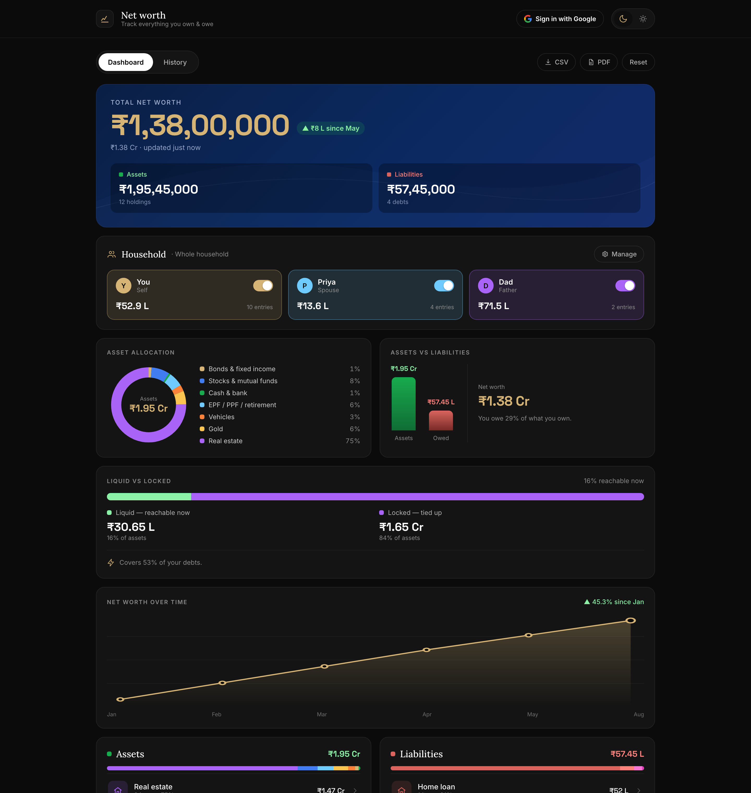
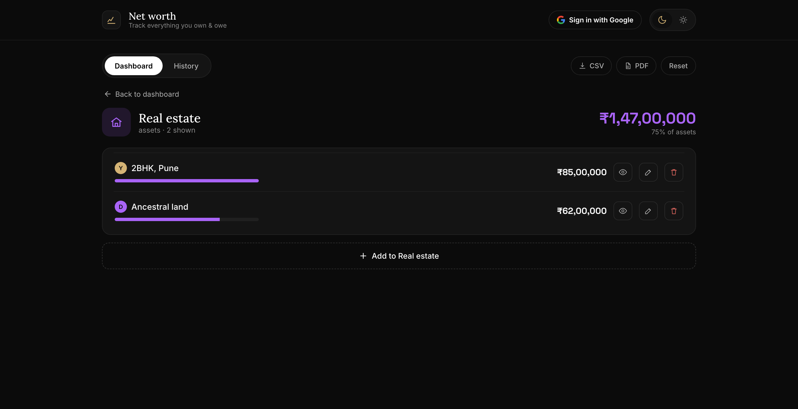
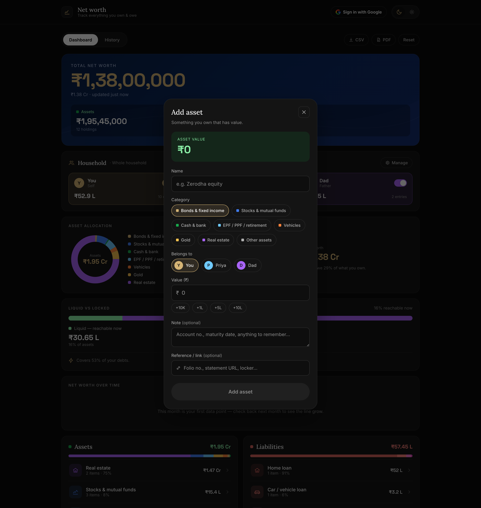
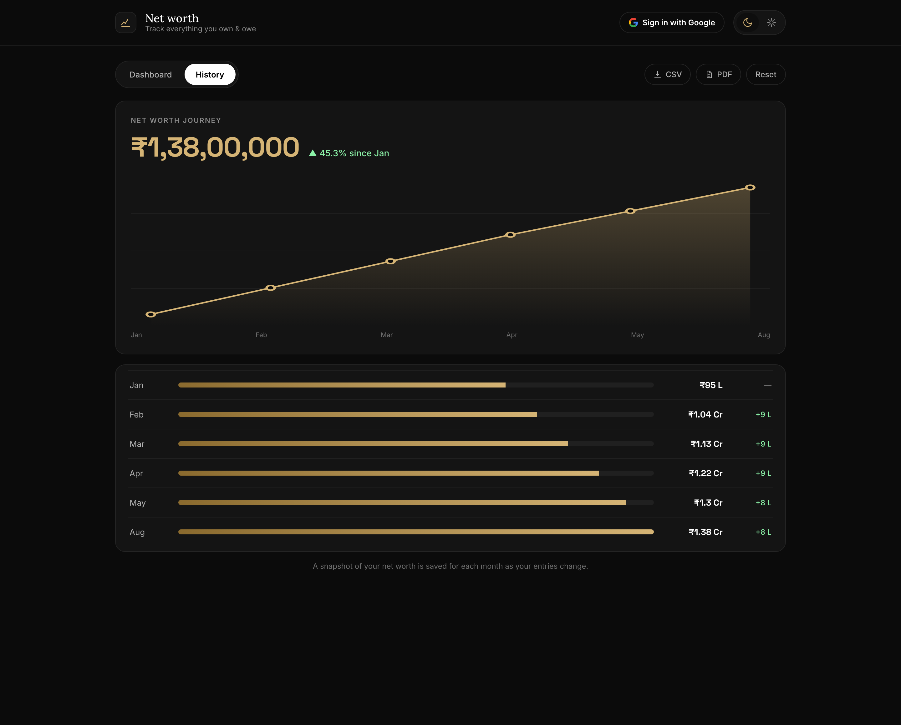
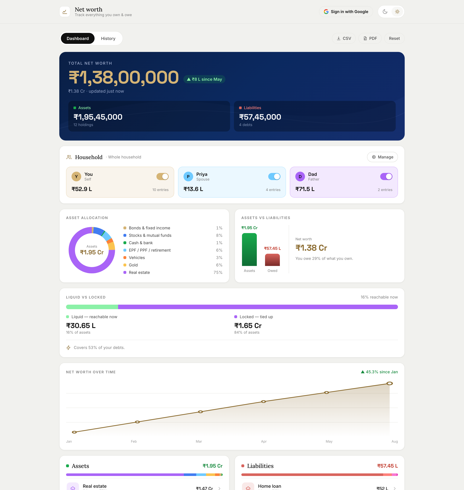
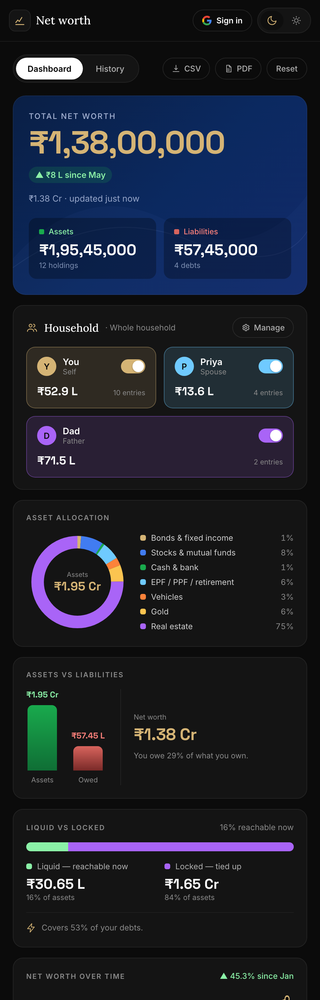

<div align="center">

# 💰 Net Worth Calculator — Web

**A private, offline-first personal net-worth tracker for India (₹), built with React, Vite & TypeScript — with optional Google Sheets sync so your data lives in _your_ Drive and stays in step with the Android app.**


</div>

---

## ✨ Overview

Track everything you **own** and everything you **owe**, across your whole household, and see your net worth come alive — allocation, liquidity, and month-over-month trend. It runs **fully client-side** in the browser (data in `localStorage`), and when you sign in with Google it mirrors your data to a private spreadsheet in your own Drive (scope `drive.file` — the app can only touch the file it created). **No backend, no analytics, no API keys, no client secret.**

<div align="center">

</div>

---

## 🚀 Features

- **Dashboard** — total net worth with a "since last month" delta, assets-vs-liabilities, an **asset-allocation donut**, liquid-vs-locked with emergency coverage, and a **net-worth trend** line.
- **Category drilldown** — per-item lists with hide/exclude-from-totals, edit, delete, notes & reference links, and owner badges.
- **Household members** — tag items to people; a per-member include/exclude toggle instantly recomputes every total.
- **Gold & silver by weight** — enter grams and price live from a per-gram rate.
- **Monthly history** — snapshots recorded automatically; trend chart + table (revealed once there are 2+ months).
- **Google Sheets sync** — sign in with Google and share one spreadsheet with the [Android app](https://github.com/shadabshaikh0/Networth-Calculator-app); edits on either platform show up on the other.
- **Polish** — onboarding checklist, sample portfolio, CSV export, save-as-PDF (print), dark/light theme, SVG charts, and a **fully responsive / mobile-friendly** layout.

<div align="center">


</div>
<div align="center">


</div>
<div align="center">

</div>

---

## 🛠️ Tech Stack

| Area | Choice |
|---|---|
| Language | **TypeScript** |
| UI | **React 18** + **Vite** (inline design-token theme, dark/light) |
| State | **Zustand** — single store, pure `derive()` view-model, unidirectional flow |
| Charts | **Inline SVG** donut & trend — no third-party chart library |
| Persistence | **`localStorage`** (offline-first) |
| Auth | **Google Identity Services** token client → `drive.file` token |
| Cloud | **Drive + Sheets v4 REST** (Bearer token only, no API key) |
| Money | Integer rupees with Indian digit grouping (lakh/crore) |
| Hosting | **Cloudflare Pages** — CSP + security headers, GitHub Actions auto-deploy |

---

## 🧱 Architecture

Clean separation of layers — the money math is a **pure, framework-free** module.

```
src/
├── types.ts          # immutable data types (Item, Member, Snapshot, SnapshotData…)
├── constants.ts      # categories, colors, seed data, theme tokens, storage keys
├── store/
│   └── useStore.ts   # Zustand store — state, actions, local persistence
├── lib/
│   ├── networth.ts   # pure money math + month helpers
│   ├── derive.ts     # raw state → display-ready view model
│   ├── history.ts    # automatic monthly net-worth snapshots
│   ├── googleAuth.ts # Google Identity Services token client
│   ├── googleSheets.ts # Drive/Sheets REST contract (find/create/load/save)
│   └── sync.ts       # sign-in reconcile + debounced push
├── components/       # TopBar, Dashboard, CategoryDrilldown, History, modals…
└── App.tsx           # layout + wiring
public/
├── _headers          # CSP + security headers (Cloudflare Pages)
└── _redirects        # SPA fallback
```

**Data flow:** raw store state → pure `derive()` → display-ready `Derived` → React. Actions live in the Zustand store, the single source of truth.

---

## ☁️ How the Google Sheets sync works

The app shares one **spreadsheet contract** with the Android app, so both platforms interoperate on a single file:

- **Find/create** — locates the sheet via a Drive `appProperties` marker (`networthApp=1`); creates `Net worth data` with tabs `Assets · Liabilities · Members · Meta` on first sign-in.
- **Read/write** — `values.batchGet` / `batchClear` + `batchUpdate` (RAW); items serialize to fixed columns, metals keep `grams`+`metal` so values reprice live, and `Meta` holds `included`/`rates`/`history` as JSON.
- **Reconcile** — on sign-in the existing sheet wins; otherwise local data is pushed (a fresh, untouched demo seed starts you on a clean sheet). Every change triggers a debounced (~1s) push.

Privacy: scope is limited to **`drive.file`**, so the app can only see the one spreadsheet it created — nothing else in your Drive. There is **no API key and no client secret** (the only credential is a public OAuth Client ID, protected by the authorized-origins allowlist).

---

## 🏃 Getting Started

### Prerequisites
Node 18+ (developed on Node 22).

### Build & run
```bash
git clone https://github.com/shadabshaikh0/networth-calculator.git
cd networth-calculator
npm install
npm run dev        # http://localhost:8743
npm run build      # production build → dist/
```
The app is fully usable offline — Google sync is optional.

### Enabling Google Sheets sync (optional)
1. Create an OAuth **Client ID (Web application)** — see [`docs/google-setup.md`](docs/google-setup.md).
2. `cp .env.example .env.local` and set `VITE_GOOGLE_CLIENT_ID=…`.
3. Restart `npm run dev` — the top bar switches from **Local only** to **Sign in with Google**.

Without a Client ID the app runs fully locally.

### Deployment
Static deploy to **Cloudflare Pages** (free), with CSP + security headers and GitHub Actions auto-deploy — see [`docs/deploy-cloudflare.md`](docs/deploy-cloudflare.md). Any static host works.

---

## 📱 Companion app

There's a native **Android** version built with Kotlin & Jetpack Compose that shares the same Google Sheet:
👉 **[Networth-Calculator-app](https://github.com/shadabshaikh0/Networth-Calculator-app)**

Build details and the shared spreadsheet contract live in [`docs/android-app-spec.md`](docs/android-app-spec.md).

---

## 📄 License

Released under the **MIT License** — see [`LICENSE`](LICENSE).

<div align="center">
<sub>Built with React, Vite & TypeScript.</sub>
</div>
